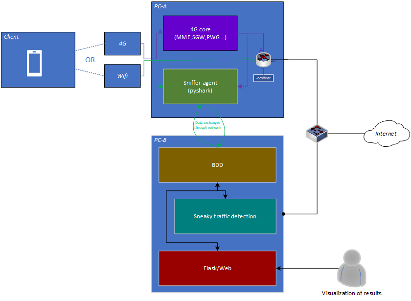

# Pandore

## _An IMT ATLANTIQUE project_

The objective of the project is to develop an auditing platform, which allows anyone wishing to know the exchanges generated by the applications on their mobile phone, to have some simple and understandable indications

## _Team_

The project is carried out in the third year. It starts in September and ends in March (6 months).

- [Salma CHAHMI](https://fr.linkedin.com/in/salma-chahmi), FISE
- [Hugo HOUILLON](https://fr.linkedin.com/in/hugo-houillon), FIP
- [Nathan OLBORSKI](https://fr.linkedin.com/in/nathan-olborski-2a1297195), FISE
- [Clément LE GRUIEC](https://www.linkedin.com/in/clement-le-gruiec/), FIP

## _Features_

- Capture traffic from any network interface
- Viewing the results in a GUI (web) :
  - Upload and Download traffic statistic
  - Servers reached (ip, DNS name and associated company)
  - A score on captured traffic (**to be determined**)
  - A focus on unwanted, unnecessary traffic 
- Export results (JSON or other)

##  _Tech_

Pandore uses a number of open source projects to work properly:

- [Python](https://www.python.org/) - An efficient programming language for data processing.
- [Pyshark](https://github.com/KimiNewt/pyshark) - Python wrapper for tshark, allowing python packet parsing using wireshark dissectors.
- [Flask](https://flask.palletsprojects.com/en/2.0.x/) - Flask is a micro web framework written in Python.
- [MariaDB](https://mariadb.org/) - MariaDB is a community-developed relational database management system.

##  _Global architecture_

Below, the diagram of our solution :

##  _Installation_

Note:  
- Pandore Agent and Pandore Server can be installed on the same machine if needed.
- Only python versions above 3.7 have been tested

### Pandore DB

All the instructions are available [here](./Database/)

### Pandore Agent :

All the instructions are available [here](./pandore-sniffer/)

### Pandore GUI

All the instructions are available [here](./webserver)
_Note that the web server embeds the analytic module._

----------
